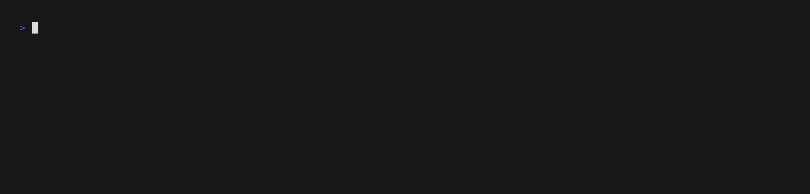

# grlx Quickstart

## <p align="center"></p>

[](https://github.com/gogrlx/bootstrap.grlx.dev/actions/workflows/ci.yml)
[](https://opensource.org/licenses/0BSD)

Want to get up and running as quickly as possible to see what all the fuss is about?
Use our bootstrap scripts!
Note that only Linux `sprout`s and `farmer`s are supported, but you can use the
CLI from macOS as well.

## Install

1. Download and initialize the command line utility from our releases to your dev machine.
```bash
# replace 'linux' with darwin if you're on macOS
curl -L https://releases.grlx.dev/linux/amd64/latest/grlx > grlx && chmod +x grlx
./grlx init
```
You'll be asked some questions, such as which interface the `farmer` is listening on, and which ports to use for communication.
Set the interface to the domain name or IP address of the `farmer`.
Once configured, the CLI prints out your administrator public key, which you'll need for the next step!
*It's recommended you now add `grlx` somewhere in your `$PATH`.*


2. On your control server, you'll need to install the `farmer`. This script may also be run as `root` instead of using sudo.
```bash
curl -L https://bootstrap.grlx.dev/latest/farmer | sudo bash
```
You'll be asked several questions about the interface to listen on, which ports to use, etc.
For the quick start, it's recommended to use the default ports (make sure there's no firewall in the way!).
You'll be prompted for an admin public key, which you should have gotten from the prior step, and a certificate host name(s).
Make sure the certificate host name matches the external-facing interface (a domain or IP address) as it will be used for TLS validation!


3. On all of your fleet nodes, you'll need to install the `sprout`.
```bash
# Set FARMERINTERFACE to your farmer's domain name. FARMERBUSPORT and FARMERAPIPORT
# variables are available in case you chose to use different ports.
curl -L https://bootstrap.grlx.dev/latest/sprout | FARMERINTERFACE=localhost sudo -E bash
```
Once the sprout is up and running, return to the CLI.



4. If all is well, you're ready to `cook`!
```bash
grlx keys accept -A
sleep 15;
grlx -T \* test ping
grlx -T \* cmd run whoami
grlx -T \* cmd run --out json -- uname -a
```


## Non-Interactive Install

Both scripts support environment variables for unattended installation:

**Farmer:**
```bash
curl -L https://bootstrap.grlx.dev/latest/farmer | \
  FARMERINTERFACE=0.0.0.0 \
  FARMERAPIPORT=5405 \
  FARMERBUSPORT=5406 \
  FARMERORGANIZATION="My Org" \
  ADMIN_PUBKEYS="ABC25HBCYNHYMIFTN372NCKASUQPJCTBA66GLKXFYM3QGRP42IC5BYYF" \
  CERT_HOSTS="farmer.example.com" \
  sudo -E bash
```

**Sprout:**
```bash
curl -L https://bootstrap.grlx.dev/latest/sprout | \
  FARMERINTERFACE=farmer.example.com \
  FARMERAPIPORT=5405 \
  FARMERBUSPORT=5406 \
  sudo -E bash
```

## Uninstall

To uninstall either component, set the `UNINSTALL` environment variable:

```bash
# Uninstall farmer
curl -L https://bootstrap.grlx.dev/latest/farmer | UNINSTALL=1 sudo -E bash

# Uninstall sprout
curl -L https://bootstrap.grlx.dev/latest/sprout | UNINSTALL=1 sudo -E bash
```

Each uninstall only removes its own files — running both components on the same host is safe.

## Supported Architectures

- x86_64 (amd64)
- i686/i386 (386)
- aarch64/arm64 (arm64)
- armv7l (arm)

## License

[0BSD](LICENSE)
